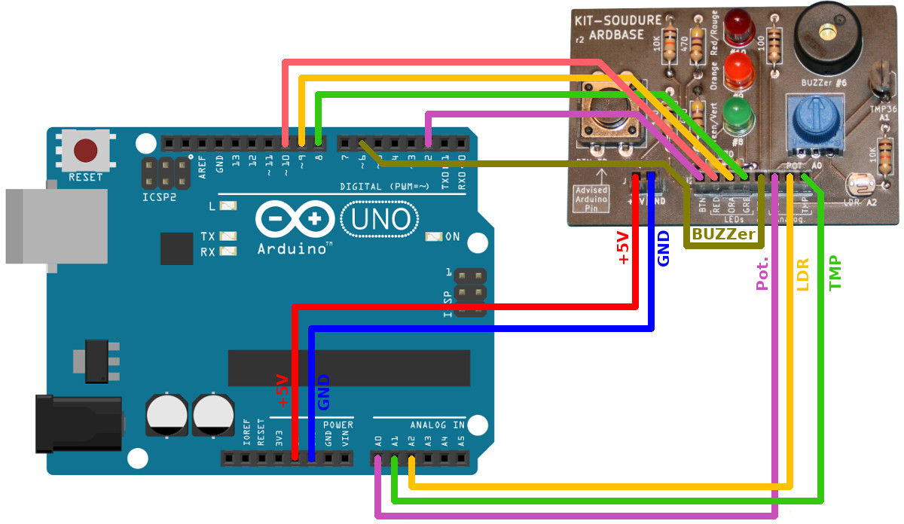

[Revenir à la page d'accueil](readme.md)

# Mini labo ArdBase avec Arduino

Le kit ArdBase peut être utilisé avec Arduino UNO sous logique 5V.

L'image ci-dessous reprend les branchements à réaliser entre un Arduino et le kit.

Voici les raccordement à réaliser:

| Arduino | ArdBase   | Description                  |
|---------|-----------|------------------------------|
| GND     | GND       | Masse commune                |
| +5V     | +5V (VCC) |                              |
| 2       | BTN       | Bouton                       |
| 10      | LED RED   | LED Rouge, PWM               |
| 9       | LED ORA   | LED Orange, PWM              |
| 8       | LED GRE   | LED Verte                    |
| A0      | POT       | Potentiomètre                |
| A2      | LDR       | Photo-Résistance             |
| A1      | TMP       | Capteur Température TMP36 |

# Exemples

* [Exemple 1](arduino/sketch_ex1_led_intensite_croissante_decroissante) : Modifie l'intensité des LEDs Rouge et Orange avec un signal PWM.
* [Exemple 2](arduino/sketch_ex2_intensite_led_potentiometre) : Modifie la luminosité d'une LED en fonction de la position du potentiomètre.
* [Exemple 3](arduino/sketch_ex3_feu_rouge_passe_au_vert_avec_bouton_poussoir) : Simlation de feux rouge (passe du vert au rouge lorsque le bouton est pressé).
* [Exemple 4](arduino/sketch_ex4_a_vous_dirais_je_maman_buzzer) : Jouer des mélodies sur le piezo buzzer.
* [Exemple 5](arduino/sketch_ex5_intensite_led_eclairement) : Varie l'intensité de la LED en fonction de la luminosité ambiante (cfr PhotoResistance)

# Remerciement

Un tout grand merci à Nicolas H.D.G., professeur au [Collège Saint-Michel de Bruxelles](https://fr.wikipedia.org/wiki/Coll%C3%A8ge_Saint-Michel_(Bruxelles)) pour sa participation à l'exploitation du kit ArdBase.
