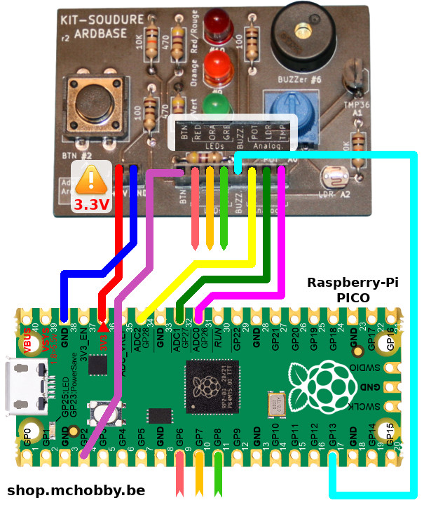
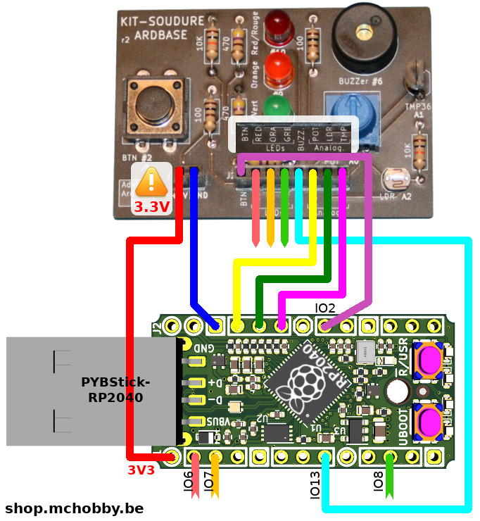

[Revenir à la page d'accueil](readme.md)

# Brancher
Le kit ArdBase peut être utilisé avec les plateformes en logiques 3.3V à base de microcontrôleur RP2040. Cela concerne le célèbre [Raspberry-Pi Pico](https://shop.mchobby.be/product.php?id_product=2025) ou la [PYBStick-RP2040](https://shop.mchobby.be/product.php?id_product=2331) (made in France).

## Mini labo ArdBase sur Raspberry-Pi Pico

L'image ci-dessous reprend le+s branchements à réaliser entre un Raspberry-Pi Pico et le kit.

Voici les raccordement à réaliser:

| Pico    | ArdBase   | Description                  |
|---------|-----------|------------------------------|
| GND     | GND       | Masse commune                |
| __3V3__ | +5V (VCC) | __Attention: 3.3V!!__        |
| GP2     | BTN       | Bouton                       |
| GP6     | LED RED   | LED Rouge, PWM               |
| GP7     | LED ORA   | LED Orange, PWM              |
| GP8     | LED GRE   | LED Verte                    |
| GP13    | Buzzer    | Piezo Buzzer, PWM            |
| ADC2 (GP28) | POT       | Potentiomètre                |
| ADC1 (GP27) | LDR       | Photo-Résistance             |
| ADC0 (GP26) | TMP       | Capteur Température TMP36 |

## Mini labo ArdBase sur PYBStick-RP2040

L'image ci-dessous reprend les branchements à réaliser entre un Raspberry-Pi Pico et le kit.

Voici les raccordement à réaliser:

| Pico    | ArdBase   | Description                  |
|---------|-----------|------------------------------|
| GND     | GND       | Masse commune                |
| __3V3__ | +5V (VCC) | __Attention: 3.3V!!__        |
| IO2     | BTN       | Bouton                       |
| IO6     | LED RED   | LED Rouge, PWM               |
| IO7     | LED ORA   | LED Orange, PWM              |
| IO8     | LED GRE   | LED Verte                    |
| IO13    | Buzzer    | Piezo Buzzer, PWM            |
| ADC2 (IO28) | POT       | Potentiomètre                |
| ADC1 (IO27) | LDR       | Photo-Résistance             |
| ADC0 (IO26) | TMP       | Capteur Température TMP36 |

# Exemples

__Exemples d'introduction__:

* [i01_button.py](pico-micropython/i01_button.py): détection de la pression sur un bouton (logique inversée).
* [i02_button.py](pico-micropython/i02_button.py): détection de la pression sur un bouton en utilisant la classe `Signal` pour revenir dans une logique positive.
* [i03_irq.py](pico-micropython/i03_irq.py): détecter la pression d'un bouton en utilisant le mécanisme d'interruption (dit IRQ).
* [i04_blink.py](pico-micropython/i04_blink.py): fait clignoter la led Rouge.
* [i05_chase.py](pico-micropython/i05_chase.py): crée un mini chenillard avec les 3 LEDs.
* [i06_pwm.py](pico-micropython/i06_pwm.py): contrôler la luminosité d'une LED. Fait pulser la LED rouge
* [i07_pot.py](pico-micropython/i07_pot.py): lecture de la valeur du potentiomètre et conversion en tension.
* [i08_ldr.py](pico-micropython/i08_ldr.py): lecture de la photoresistance (LDR) et calculer le minimum et le maximum.
* [i09_tmp36.py](pico-micropython/i09_tmp36.py): lecture de la température grâce au capteur analogique TMP36.
* [i10_tone.py](pico-micropython/i10_tone.py): play a tone at 261 Hertz (DO) for 1 second.

__Petits exercices pratiques__:
__
TODO

* [Exemple 1](todo) : Modifie l'intensité des LEDs Rouge et Orange avec un signal PWM.
* [Exemple 2](todo) : Modifie la luminosité d'une LED en fonction de la position du potentiomètre.
* [Exemple 3](todo) : Simlation de feux rouge (passe du vert au rouge lorsque le bouton est pressé).
* [Exemple 4](todo) : Jouer des mélodies sur le piezo buzzer.
* [Exemple 5](todo) : Varie l'intensité de la LED en fonction de la luminosité ambiante (cfr PhotoResistance)
