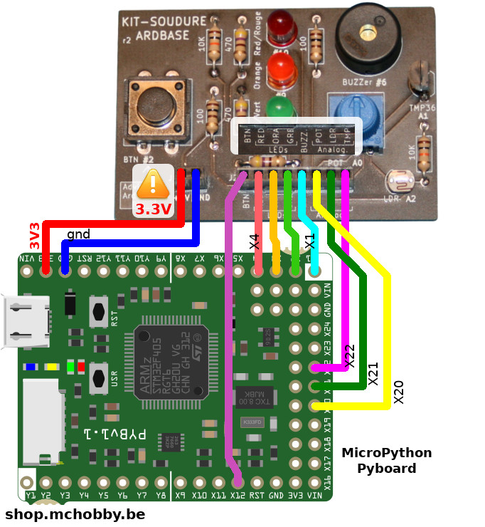
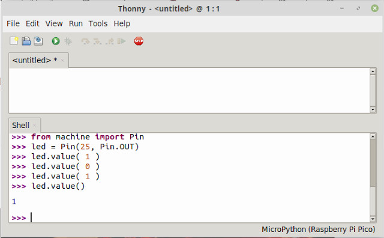

[Revenir à la page d'accueil](readme.md)

# Brancher le Mini labo ArdBase sur Pyboard
Le kit ArdBase peut être utilisé avec les plateformes en logiques 3.3V comme la [MicroPython Pyboard](https://shop.mchobby.be/product.php?id_product=570).

L'image ci-dessous reprend les branchements à réaliser entre le kit et une carte MicroPython Pyboard.

Voici les raccordement à réaliser:

| Pico    | ArdBase   | Description                  |
|---------|-----------|------------------------------|
| GND     | GND       | Masse commune                |
| __3V3__ | +5V (VCC) | __Attention: 3.3V!!__        |
| X12     | BTN       | Bouton                       |
| X4      | LED RED   | LED Rouge, PWM               |
| X3      | LED ORA   | LED Orange, PWM              |
| X2      | LED GRE   | LED Verte                    |
| X1      | Buzzer    | Piezo Buzzer, PWM            |
| X21 (ADC) | POT       | Potentiomètre                |
| X22 (ADC) | LDR       | Photo-Résistance             |
| X23 (ADC) | TMP       | Capteur Température TMP36 |

# Exemples

Pour pouvoir tester les scripts sur votre plateforme MicroPython Pyboard, vous pouvez utiliser ThonnyIDE.

Voyez les détails de cet [article sur le blog de MCHobby](https://arduino103.blogspot.com/2022/01/micromod-rp2040-pico-utiliser-thonny.html) pour installer et utiliser Thonny avec une plateforme RP2040.

__Bibliothèque__:

Le bibliothèque [pwm.py](https://github.com/mchobby/pyboard-driver/blob/master/UNO-R3/lib/pwm.py) doit être copié sur la carte MicroPython. Celle-ci est requise par certains exemples.

__Exemples d'introduction__:

* [i01_button.py](pyboard-micropython/i01_button.py): détection de la pression sur un bouton (logique inversée).
* [i02_button.py](pyboard-micropython/i02_button.py): détection de la pression sur un bouton en utilisant la classe `Signal` pour revenir dans une logique positive.
* [i03_irq.py](pyboard-micropython/i03_irq.py): détecter la pression d'un bouton en utilisant le mécanisme d'interruption (dit IRQ).
* [i04_blink.py](pyboard-micropython/i04_blink.py): fait clignoter la led Rouge.
* [i05_chase.py](pyboard-micropython/i05_chase.py): crée un mini chenillard avec les 3 LEDs.
* [i06_pwm.py](pyboard-micropython/i06_pwm.py): contrôler la luminosité d'une LED. Fait pulser la LED rouge
* [i07_pot.py](pyboard-micropython/i07_pot.py): lecture de la valeur du potentiomètre et conversion en tension.
* [i08_ldr.py](pyboard-micropython/i08_ldr.py): lecture de la photoresistance (LDR) et calculer le minimum et le maximum.
* [i09_tmp36.py](pyboard-micropython/i09_tmp36.py): lecture de la température grâce au capteur analogique TMP36.
* [i10_tone.py](pyboard-micropython/i10_tone.py): play a tone at 261 Hertz (DO) for 1 second.
