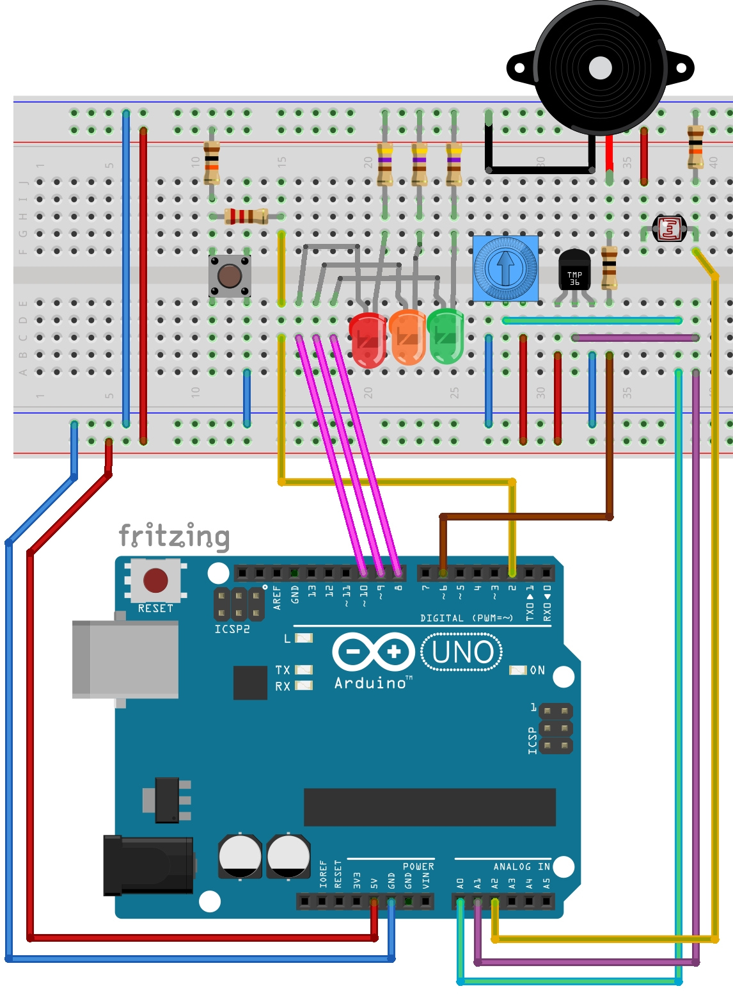

# Mini labo Arduino - Kit appprentissage soudure (v1.1)

Voici des codes d'exemples pour le [Kit appprentissage soudure - Mini labo Arduino](https://shop.mchobby.be/cartes-kits/1124-kit-appprentissage-soudure-3232100011243.html), un complément pour workshop qui permet d'ajouter une étape d'__apprentissage à la soudure__  + réalisation d'un __mini laboratoire d'expérimentation Arduino__.

Un chouette ajout pour les sessions de __formation/apprentissage/workshop__.

Ce kit reprend quelques éléments de bases parmi ceux que vous rencontrerez régulièrement si vous voulez pousser la curiosité dans la manipulation du fer à souder.
Ce kit est composé en deux parties distinctes:

* __Partie 1:__ nous avons placer une plaque de prototypage sur laquelle vous pourrez faire vos expérimentation de soudure avec un pinHeader (1x6 broches) + 1x connecteur femelle deux broches. Vous pourrez ajouter des composants glané à gauche et a droite (ou fournit en vrac par votre formateur) pour faire vos différents essais de soudure. [Voyez cette page de notre tutoriel](https://wiki.mchobby.be/index.php?title=ADF-RTC-DS1307-SOUDER), il reprend des conseils, truc & astuce pour démarrer rapidement et vous sentir à l'aise avec les opérations de soudure. Voyez aussi nos deux vidéos YouTube sur la soudure (partie 1 et partie 2)
* __Partie 2:__ nous avons inclus une série de composant que vous pourrez utiliser avec un kit basic de formation Arduino... de quoi découvrir le b.a.-ba de la programmation Arduino sur breadboard. Ces composants permettent de réaliser une série d'expérimentation en entrée/sortie digitale, entrée analogique, sortie PWM. Voyez ci-dessous plus plus d'information.
* __Partie 3:__ appliquez les compétences acquises en partie 1 et partie 2 pour souder votre petit laboratoire d'expérimentation Arduino.

# Plan de montage

# Ressources

* Fiche produit du [Kit appprentissage soudure - Mini labo Arduino](https://shop.mchobby.be/cartes-kits/1124-kit-appprentissage-soudure-3232100011243.html)

# Remerciement

Un tout grand merci à Nicolas H.D.G., professeur au [Collège Saint-Michel de Bruxelles](https://fr.wikipedia.org/wiki/Coll%C3%A8ge_Saint-Michel_(Bruxelles)).