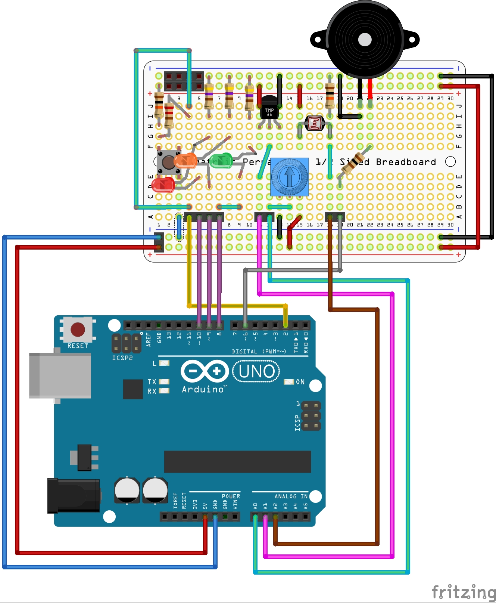

# Mini labo Arduino - Kit appprentissage soudure (v1.1)

Voici des codes d'exemples pour le [Kit appprentissage soudure - Mini labo Arduino](https://shop.mchobby.be/cartes-kits/1124-kit-appprentissage-soudure-3232100011243.html), un complément pour workshop qui permet d'ajouter une étape d'__apprentissage à la soudure__  + réalisation d'un __mini laboratoire d'expérimentation Arduino__.

Un chouette ajout pour les sessions de __formation/apprentissage/workshop__.

Ce kit reprend quelques éléments de bases parmi ceux que vous rencontrerez régulièrement si vous voulez pousser la curiosité dans la manipulation du fer à souder.
Ce kit est composé en deux parties distinctes:

# ArdBase : en Kit

Le projet est disponible en [Kit appprentissage soudure - Mini labo Arduino](https://shop.mchobby.be/cartes-kits/1124-kit-appprentissage-soudure-3232100011243.html) facile à assembler.

# ArdBase : montage DIY

Vous pouvez également réaliser le montage sur un Breadboard ou plaque de prototypage si vous ne disposez pas du kit.

# Ressources

* Les sous-répertoires de ce dépôt contient des croquis d'exemples basés sur ce kit.

# Où acheter
* Fiche produit du [Kit appprentissage soudure - Mini labo Arduino](https://shop.mchobby.be/cartes-kits/1124-kit-appprentissage-soudure-3232100011243.html)

# Remerciement

Un tout grand merci à Nicolas H.D.G., professeur au [Collège Saint-Michel de Bruxelles](https://fr.wikipedia.org/wiki/Coll%C3%A8ge_Saint-Michel_(Bruxelles)).
