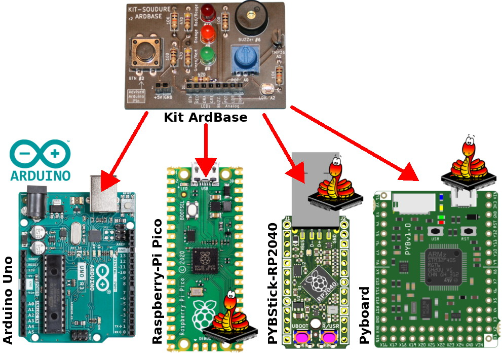

# Mini labo Arduino ou MicroPython - Kit apprentissage soudure (v1.1)

Voici des codes d'exemples pour le [Kit appprentissage soudure - Mini labo](https://shop.mchobby.be/cartes-kits/1124-kit-appprentissage-soudure-3232100011243.html), un kit qui convient aussi bien pour Arduino (logique 5V) que pour les cartes MicroPython (logique 3.3V).
Il reprend quelques éléments de bases parmi ceux que vous rencontrerez régulièrement si vous voulez pousser la curiosité dans la manipulation du fer à souder.

Ce mini-labo permet d'ajouter une étape d'__apprentissage à la soudure__  + réalisation d'un __mini laboratoire d'expérimentation__.

Un chouette ajout pour les sessions de __formation/apprentissage/workshop__ d'autant qu'il peut être utilisé avec différents microcontrôleurs.

# ArdBase : en Kit

Le projet est disponible en [Kit appprentissage soudure - Mini labo Arduino](https://shop.mchobby.be/cartes-kits/1124-kit-appprentissage-soudure-3232100011243.html) facile à assembler.

Les __instructions d'assemblage__ sont [disponibles sur le Wiki de MCHobby](https://wiki.mchobby.be/index.php?title=ArdBase).

Une fois assemblé, vous pouvez utiliser le kit ArdBase avec:
* [ArdBase avec Arduino](readme-arduino.md)
* [ArdBase avec Pico sous MicroPython](readme-pico.md)
* [ArdBase avec PYBStick-RP2040 sous MicroPython](readme-pico.md) identique au Pico
* [ArdBase avec Pyboard](readme-pyboard.md)

# ArdBase DIY

Si vous ne disposez pas du kit mais des différents composants nécessaire alors vous pouvez également réaliser le montage sur un Breadboard ou une plaque de prototypage.

Vous trouverez les [instructions de montage DIY sur cette page](readme-diy.md).

# Où acheter
* Fiche produit du [Kit appprentissage soudure - Mini labo](https://shop.mchobby.be/cartes-kits/1124-kit-appprentissage-soudure-3232100011243.html)
* [Raspberry-Pi Pico avec connecteur](https://shop.mchobby.be/product.php?id_product=2036) @ MCHobby
* [Raspberry-Pi Pico](https://shop.mchobby.be/product.php?id_product=2025) @ MCHobby
* [PYBStick-RP2040](https://shop.mchobby.be/product.php?id_product=2331) @ MCHobby
